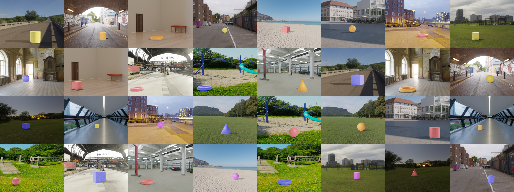

# candle-simulator
This repository consists of Blender python scripts and corresponding assets to generate variants of the CANDLE dataset.

# Environment Setup
Download and install [Blender](https://www.blender.org/). Make sure that it's accesible from the command line. 

Note: Tests and rendering were performed on version 2.90. Unless future versions include breaking changes, functionality should be largely unaffected. Will be happy to receive a PR/issue if any issues arise.

# Running the script
The main script `candle_simulator.py` runs in an instance of blender invoked by the command:
```
# starts blender in the background, without audio and runs the python script
$ blender -b -noaudio -P candle_simultor.py
```

# The rendered CANDLE dataset

The rendered version of the dataset is provided at [the CANDLE repository](https://causal-disentanglement.github.io/CANDLE/).

# License
This work is licensed under the [MIT License](https://choosealicense.com/licenses/mit/).